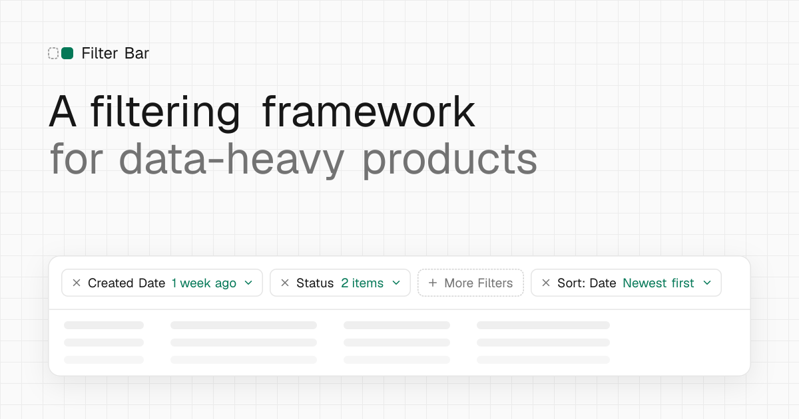

# Filter Bar

**A filtering framework for data-heavy products.** Filters people can see, find and undo, in one row above your data. Distributed as a [shadcn/ui](https://ui.shadcn.com) registry item, so you install the source and make it yours.



- **Applied filters stay visible.** Every applied filter is a chip with its value, so nobody has to open a "Filters (3)" menu to remember why rows are missing.
- **The sort stays in view.** The active sort is a chip too, visible however far a wide table scrolls.
- **Important filters up front.** One to three quick filters are always there; the rest wait in a searchable More Filters menu.
- **One row.** Title, search, filters and sort share a single toolbar, so the data keeps the screen.

Plus the details: humanised date presets ("1 week ago") in one click, selected options that never jump under the cursor, an Apply step for heavy tables (or instant mode for light ones), filters in the URL, full keyboard support, and every size and colour as a CSS variable.

The thinking behind it is in the article [Crafting a modular filtering framework for data-heavy applications](https://medium.com/design-bootcamp/crafting-a-modular-filtering-framework-for-data-heavy-applications-0f0a184645eb).

## Install

Requirements: React 19, Tailwind CSS v4, and shadcn/ui set up with a **Radix-based style** (for example `npx shadcn@latest init --base radix`). Base UI styles aren't supported yet.

```bash
npx shadcn@latest add https://YOUR-SITE/r/filter-bar.json
```

This adds `components/filter-bar/`, the shadcn components it uses (button, calendar, command, dialog, input, popover, separator, tooltip), `date-fns`, `lucide-react`, and the `--fb-*` CSS variables. Chip tooltips need shadcn's `<TooltipProvider>` above the bar, usually in `app/layout.tsx`.

For client-side filtering with TanStack Table v8, add the adapter:

```bash
npx shadcn@latest add https://YOUR-SITE/r/filter-bar-tanstack.json
```

> Replace `YOUR-SITE` with wherever this project is deployed. The site's install commands always show the right address.

## Usage

```tsx
"use client";

import { useState } from "react";

import { FilterBar } from "@/components/filter-bar/filter-bar";
import type { FilterDefinition, SortState } from "@/components/filter-bar/types";
import { useFilterUrlState } from "@/components/filter-bar/url-state";
import { useFilters } from "@/components/filter-bar/use-filters";

const definitions: FilterDefinition[] = [
  { id: "createdAt", label: "Created Date", type: "dateRange", tier: "quick" },
  {
    id: "status",
    label: "Status",
    type: "multiSelect",
    tier: "quick",
    options: [
      { value: "open", label: "Open" },
      { value: "closed", label: "Closed" },
    ],
  },
  { id: "batchId", label: "Batch ID", type: "text", tier: "more" },
];

export function Documents() {
  const url = useFilterUrlState(definitions); // optional: keep filters in the URL
  const filters = useFilters({ definitions, ...url });
  const [sort, setSort] = useState<SortState>();

  // filters.applied is what to filter by: send it to your API, or use the TanStack adapter.
  return <FilterBar filters={filters} sort={sort} onSortChange={setSort} />;
}
```

With TanStack Table, give each column the same id as its filter and the matching filter function:

```tsx
import {
  dateRangeFn, multiSelectFn, textFn, toColumnFilters,
} from "@/components/filter-bar-tanstack/adapter";

const columns = [
  { id: "status", accessorKey: "status", filterFn: multiSelectFn },
  { id: "createdAt", accessorKey: "createdAt", filterFn: dateRangeFn },
  { id: "batchId", accessorKey: "batchId", filterFn: textFn },
];

const columnFilters = useMemo(() => toColumnFilters(filters.applied, definitions), [filters.applied]);
const table = useReactTable({ data, columns, state: { columnFilters }, /* … */ });
```

The full API (filter definitions, `useFilters`, URL sync, the adapter, keyboard behaviour) is on the site's `/docs` page.

## Theming

Everything is a CSS variable, installed with the component. The site's `/customise` page writes overrides for you.

```css
:root {
  --fb-density: 1;                   /* 0.875 compact · 1 · 1.125 comfortable */
  --fb-chip-radius: var(--radius-sm);
  --fb-chip-border-style: dashed;    /* unset chips */
  --fb-accent: var(--primary);       /* values, Apply, checkmarks, focus borders */
}
```

## Development

This repo is the registry and its docs site (Next.js App Router, TypeScript, Tailwind v4, shadcn/ui).

```bash
pnpm install
pnpm dev              # docs site and demos on http://localhost:5000
pnpm test             # unit and component tests (Vitest + Testing Library)
pnpm test:e2e         # end-to-end and accessibility tests (Playwright + axe)
pnpm typecheck
pnpm lint
pnpm registry:build   # builds the registry JSON into public/r
```

The component source is in `registry/filter-bar/` and `registry/filter-bar-tanstack/`. Behaviour is specified in [`SPEC.md`](SPEC.md); every rule marked `[T]` there has a test.

## Credits

Designed by Nahid Noushathu, from the pattern described in [Crafting a modular filtering framework for data-heavy applications](https://medium.com/design-bootcamp/crafting-a-modular-filtering-framework-for-data-heavy-applications-0f0a184645eb).

## Licence

[MIT](LICENSE)
